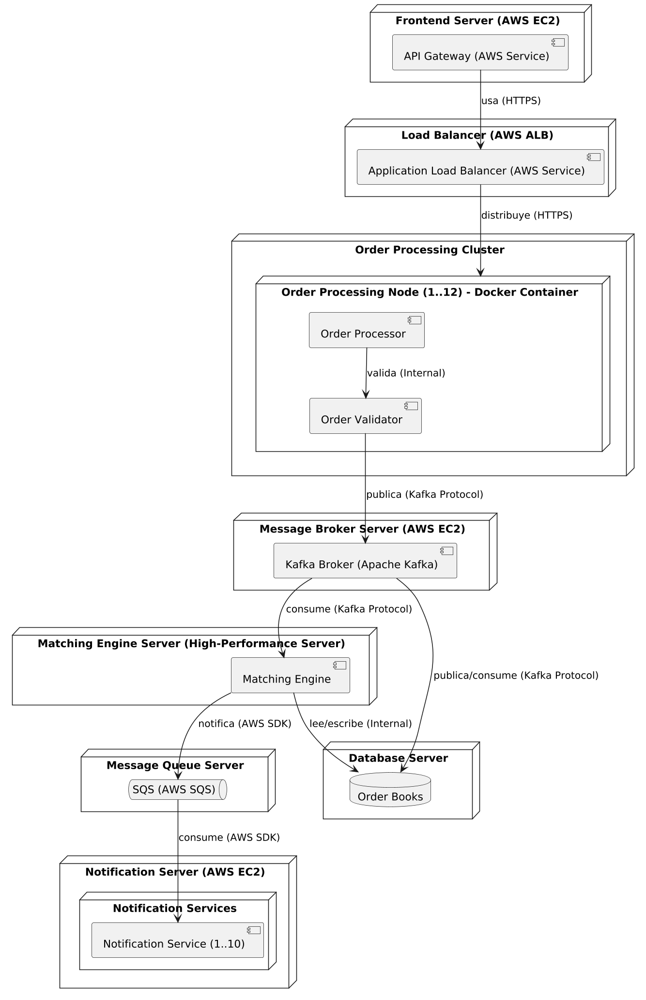

# Reto 1 - Curso de arquitectura de Software
El objetivo del reto 1 consiste disenar una arquitectura de software para un problema de un sistema de procesamiento de compra y venta de activos. A continuacion se muestra la vista de despliegue de la solucion planteada

## Architecturally Significant Requirements (ASR)

Se solicitaba plantear dos requerimientos significativos de arquitectura los cuales estuvieran relacionados con latencia y escalabilidad. 

- **Escalabilidad**: manejar picos de hasta 10,000 órdenes por minuto (ventas y compras combinadas) durante eventos de alta demanda sin degradación en la latencia.

- **Latencia**: Una vez que se ejecute el emparejamiento, la confirmación debe ser enviada para ambas partes en menos de 200 milisegundos. Garantizar esta latencia en un escenario de 1000 mensajes por minuto

## Tacticas de arquitectura 
Para resolver los dos ASR planteados, se propone las siguientes tacticas de arquitectura:

- Para escalabilidad se propone usar escalado horizontal. La hipotesis que se plantea es: Para garantizar las condiciones, se propone usar un cluster ECS de tipo Fargate con 12 repliacas de la misma tarea.

- Para latencia se propone usar un microservicio con concurrencia y un servicio de mensajeria SQS para recibir los mensajes. La hipotesis planteada es: 10 hilos del mismo microservicios es capaz de garantizar dicha latencia y procesar 1000 notificaciones en 1 minuto. 

## Experimentos
### Experimento 1

Para escalabilidad se propone generar un endpoint en FASTApi el cual toma la peticion y simula un procesamienot de una orden. 
el mockup se hace con una operacion bloqueante de 50 ms y una operacion no bloqueante de 130 ms. Dicho microservicio se desplegara en un cluster de ECS tipo Fargate y se hace una prueba de performance utilizando JMeter. 

El codigo de la aplicacion la puede encontrar en [./ms_procesamiento_ordenes/src/app.py](./ms_procesamiento_ordenes/src/app.py), la infraestructura de despliegue del experimento en los archivos terraform [./deployment/exp1/](./deployment/exp1/) y adicionalmente el analisis de los resultados de la prueba en el notebook [./ms_procesamiento_ordenes/notebooks/analisis_exp.ipynb](./ms_procesamiento_ordenes/notebooks/analisis_exp.ipynb)

#### Video ejecución experimento 1

### Experimento 2

Para la latencia se crea un microservicio en python que es capaz de procesar la cola de mensajeria en SQS. Primero se muestra como el microservicio procesa la cola de forma secuencial, y posteriormente utilizando concurrencia. 

El codigo de la aplicacion la puede encontrar en [./ms_notificaciones/scripts/push_and_proccess_notifications.py](./ms_notificaciones/scripts/push_and_proccess_notifications.py), la infraestructura de despliegue del experimento en los archivos terraform [./deployment/exp2/](./deployment/exp2/) y adicionalmente el analisis de los resultados de la prueba en el notebook [./ms_notificaciones/notebooks/analisis_exp.ipynb](./ms_notificaciones/notebooks/analisis_exp.ipynb)

#### Video ejecución experimento 2

