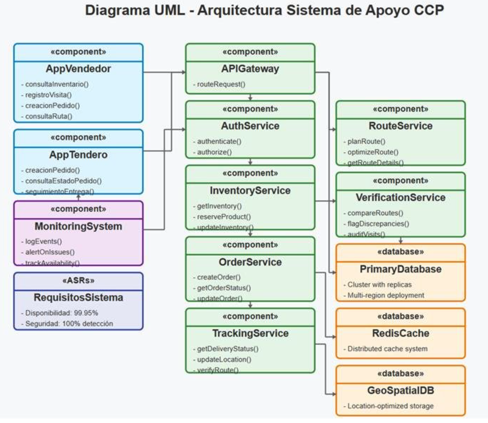
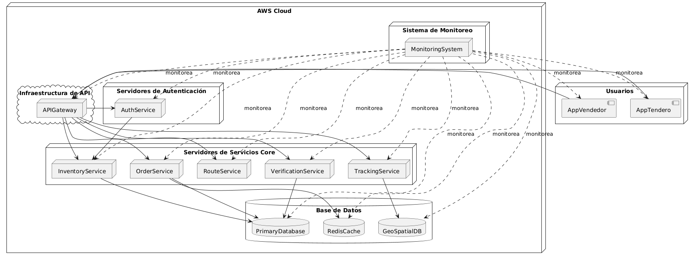

# Reto 2 - Curso de arquitectura de Software
El objetivo del reto 2 consiste disenar una arquitectura de software para un sistema de ordenes de servicio generadas por tenderos y vendedores. El objetivo principal es el de analizar ASR de disponibilidad y seguridad. A continuacion el diagrama de componentes de la solución

## Architecturally Significant Requirements (ASR)

Se solicitaba plantear dos requerimientos significativos de arquitectura los cuales estuvieran relacionados con disponibilidad y seguridad

- **Disponibilidad**: En el componente de creación de pedido se debe detectar fallas en la creación en menos de 400ms

- **Seguridad**: Detectar el 100% de inconsistencias entre los registros de visitas del vendedor y la ruta realizada

## Tacticas de arquitectura 
Para resolver los dos ASR planteados, se propone las siguientes tacticas de arquitectura:

- Para disponibilidad se propone implementar la tactica de deteccion de falla mediante un sistema de monitoreo de salud del microservicios.

- Para seguridad de propone implementar la táctica de mediante un sistema de monitoreo de información georeferenciada de las rutas 

## Experimentos
### Experimento 1

Para el ASR de disponibilidad se realiza un despliegue del microservicio de creacion de ordendes de servicio con tres endpoints (order_create, status_order and update_order). Posteriormente se crea un servicio de monitoreo el cual va a estar realizando un monitoreo y deteccion activa al microservicios realizando 5 pasos: validando el health del servicio, creando una orden ficticia, validar la creacion en base de datos, actualizacion de la orden, y validacion de nuevo. 

El codigo de la aplicacion del microservicio de ordendes se encuentra en [./src/ms_order_service/src/main.py](./src/ms_order_service/src/main.py), el del sistema de monitoreo en [./src/ms_monitoring_system/src/main.py](./src/ms_monitoring_system/src/main.py), y finalmente el analisis de resultados de la prueba en el notebook [./notebooks/exp1_disponibilidad/analisis_resultados.ipynb](./notebooks/exp1_disponibilidad/analisis_resultados.ipynb)

#### Video ejecución experimento 1

### Experimento 2

Para el ASR de seguridad se realiza un despliegue del microservicio de monitoreo de rutas con un endpoint (/monitor/tracking). Este estará realizando monitoreo de las rutas con información geoespacial identificando discrepancias entres las rutas válidas y las rutas realizadas por los conductores, con un umbral de 500 mts. 

El codigo de la aplicacion del microservicio de ordendes se encuentra en [./src/ms_order_service/src/main.py](./src/ms_order_service/src/main_tracking.py), y finalmente  lso resultados de la prueba en el html [./graphics/rutas_medellin_discrepancias.html](./graphics/rutas_medellin_discrepancias.html)

#### Video ejecución experimento 2

